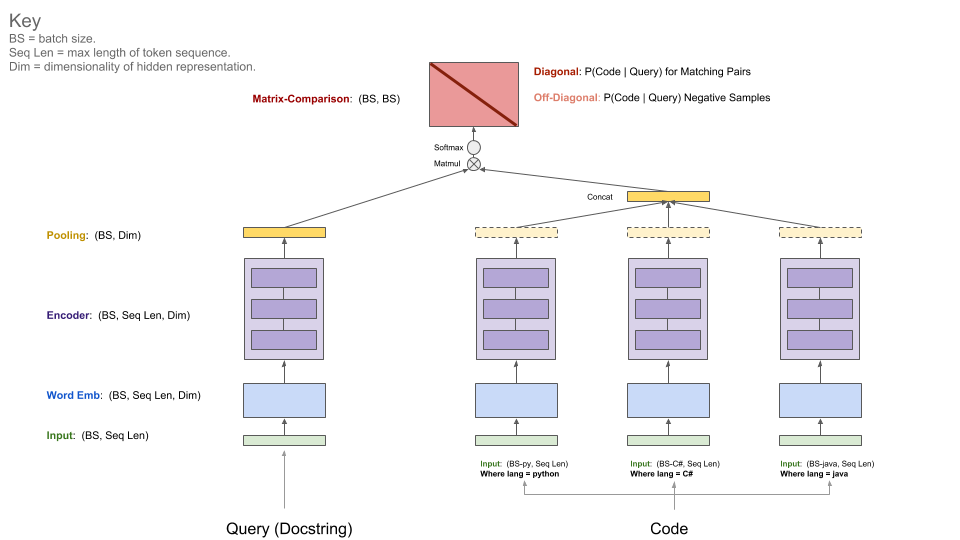

[](https://dev.azure.com/hahusain/hahusain/_build/latest?definitionId=4&branchName=master) [](https://opensource.org/licenses/MIT)  [](https://www.python.org/downloads/release/python-360/)

**Table of Contents**

TODO: how to update this for the new readme structure?
<!-- TOC depthFrom:1 depthTo:6 withLinks:1 updateOnSave:1 orderedList:0 -->

- [Introduction](#introduction)
  - [Project Overview](#project-overview)
  - [Data](#data)
	- [Network Architecture](#network-architecture)
	- [Evaluation](#evaluation)
	- [Leaderboard](#leaderboard)
- [Running the Baseline Model](#running-the-baseline-model)
  - [Setup](#setup)
  - [Training](#training)
  - [W&B Setup](#w&b-setup)
- [Data Details](#data-details)
  - [Data Acquisition](#data-acquisition)
  - [Preprocessed Data Format](#preprocessed-data-format)
	- [(Optional) Downloading Datasets from S3](#optional-downloading-datasets-from-s3)
		- [Preprocessed data](#preprocessed-data)
		- [Raw Data - Filtered](#raw-data---filtered)
		- [Raw Data - Unfiltered](#raw-data---unfiltered)
- [References](#references)
  - [How to Contribute](#how-to-contribute)
  - [Other READMEs](#other-readmes)
  - [License](#license)
  - [Important Documents](#important-documents)

<!-- /TOC -->

# Introduction

## Project Overview

  **CodeSearchNet** is a collection of datasets and a deep-learning framework built on [TensorFlow](https://github.com/tensorflow/tensorflow) that we use to research the problem of code retrieval using natural language.  This research is a continuation of some ideas presented in this [blog post](https://githubengineering.com/towards-natural-language-semantic-code-search/) and is a joint collaboration between GitHub and the [Deep Program Understanding](https://www.microsoft.com/en-us/research/project/program/) group at [Microsoft Research - Cambridge](https://www.microsoft.com/en-us/research/lab/microsoft-research-cambridge/). Our intent is to present and provide a platform for this research to the community by providing the following:

  1. Instructions for obtaining a large corpora of relevant data
  2. Open source code for a range of baseline models, together with pre-trained weights.
  3. Baseline evaluation metrics and utilities.
  4. Mechanisms to report new results on a leaderboard. [Weights & Biases](https://www.wandb.com/) is hosting the leaderboard, free to community for open source projects. 
  4. Links to pre-trained models.

More context regarding the motivation for this problem is in our blog post [TODO here](#TODO-TODO).

## Data

  The primary dataset consists of 3.2 million (`comment`, `code`) pairs from open source repositories.  Concretely, a `comment` is a top-level function or method comment (ex: in Python called docstrings), and `code` is either an entire function or method. Currently the dataset only contains Python, C#, and Java code, but we plan to expand to additional languages over time.  Throughout this repo, we refer to the terms docstring and query interchangeably.  Furthermore, we partition the data into train, validation, and test splits such that code from the same file can only exist in one partition. Currently this is the only dataset on which we train our model. Summary stastics about this dataset can be found in [this notebook](notebooks/ExploreData.ipynb)

  We use three additional datasets for evaluation only (not for training).

  1. [CoNala](https://conala-corpus.github.io/): curated Stack Overflow data that is human-labeled with intent.  From this we construct a parallel corpus of (code, intent). 

  2. [StaQC](http://web.cse.ohio-state.edu/~sun.397/docs/StaQC-www18.pdf): another dataset manually curated from Stack Overflow with (code, question) pairs

  3. [Rosetta Code](http://www.rosettacode.org/wiki/Rosetta_Code): We use data from this site to construct several parallel corpora containing pairs of code snippets that accomplish the same task in Python, C#, or Java. 

## Network Architecture

- This model ingests a parallel corpus of (`comment`, `code`) pairs and learns to retrieve a code snippet given a natural language query.

- The query has a single encoder, whereas each programming language has its own encoder (our initial release has three languages: Python, Java, and C#).

- Available encoders: Neural-Bag-Of-Words, RNN, 1D-CNN, Self-Attention (BERT), 1D-CNN+Self-Attention Hybrid

The diagram below illustrates the general architecture of our model:

  

## Evaluation

  The metric we use for evaluation is [Mean Reciprocal Rank](https://en.wikipedia.org/wiki/Mean_reciprocal_rank).  To calculate MRR, we use distractors from negative samples within a batch at evaluation time, with a fixed batch size of 1,000 (Note: we fix the batch size to 1,000 at evaluation time to standardize the MRR calculation, and do not do this at training time.)
  
For example, consider a dataset of 10,005 (`comment`, `code`)  pairs. For every (`comment`, `code`) pair in each of the 10 batches (we exclude the remaining 5 examples), we evaluate the our ability to retrieve code using the comment. We then average the MRR across all batches to compute MRR for the dataset.  If the dataset is not divisible by 1,000, we exclude the final batch (any remainder that is less than 1,000) from the MRR calculation.

  We also evaluate our model on external datasets that more closely resemble semantic search and test our ability to learn generalized representations of code.  Throughout the documentation, we refer to these as **Auxiliary tests**.

  1. **Function Name Prediction:**: Using our primary dataset, we train to retrieve the body of a function or method given a function or method name.

  2. [CoNala](https://conala-corpus.github.io/): given a parallel corpus of (code, intent) pairs from Stack Overflow, retrieve code relevant to the query

  3. [StaQC](http://web.cse.ohio-state.edu/~sun.397/docs/StaQC-www18.pdf): given a parallel corpus of (code, question) pairs from Stack Overflow, retrieve code relevant to the query

  4. [Rosetta Code](http://www.rosettacode.org/wiki/Rosetta_Code): We use this parallel corpus to match code snippets across programming languages: given a snippet of Python code, retrieve code in Java or C# that accomplishes the same task.

## Leaderboard

  We are using a leaderboard for this project to encourage collaboration and improve reproducibility.  It is hosted by [Weights & Biases](https://www.wandb.com/) (W&B), which is free for open-source projects.  Our entries in the leaderboard link to detailed logs of our training and evaluation metrics, as well as model artifacts.  While logging your models on this system is optional, we encourage participants who want to be included on this leaderboard to provide as much transparency as possible. Here is the current leaderboard: 

  **Authors**|**GitHub Repo**|**Notes**|**Primary Dataset MRR**|**FuncName MRR**|**CoNaLa MRR**|**StaQC MRR**|**Rosetta MRR**
  :-----:|:-----:|:-----:|:-----:|:-----:|:-----:|:-----:|:-----:
  GitHub+Microsoft|[link](https://github.com/ml-msr-github/semantic-code-search)|Neural Bag of Words (cosine loss) |0.662|**0.419**|**0.259**|**0.168**|**0.123**
  GitHub+Microsoft|[link](https://github.com/ml-msr-github/semantic-code-search)|1DCNN+SelfAttention|**0.757**|0.416|0.135|0.106|0.054

  We encourage the community to improve on these baselines by submitting PRs with your new benchmarks. Please see these [instructions for submitting to the leaderboard](src/docs/LEADERBOARD.md).  Some requirements for submission:  

    - Results must be reproducible with clear instructions.
    - Code must be open sourced and clearly licensed.
    - Model must demonstrate an improvement on at least one of the auxiliary tests.

# Running the Baseline Model

## Setup

  You should only have to perform the setup steps once to download the data and prepare the environment.

  1. Due to the complexity of installing all dependencies, we prepared Docker containers to run this code. You can find instructions on how to install Docker in the [official docs](https://docs.docker.com/get-started/).  Additionally, you must install [Nvidia-Docker](https://github.com/NVIDIA/nvidia-docker) to satisfy GPU-compute related dependencies.  For those who are new to Docker, this [blog post](https://towardsdatascience.com/how-docker-can-help-you-become-a-more-effective-data-scientist-7fc048ef91d5) provides a gentle introduction focused on data science.

  2. After installing Docker, you need to download the pre-processed datasets, which are hosted on S3.  You can do this by running `script/setup`.

      > script/setup

      This will build the required containers and download the primary and auxiliary datasets. By default, the data is downloaded into the `resources/data/` folder inside this repository, with the directory structure described [here](resources/README.md).

      **The datasets you will download (most of them compressed) have a combined size of only ~ 3.5 GB.** 

      For more about the data, see [Data Details](#data-details) below as well as [this notebook](notebooks/ExploreData.ipynb).


## Training

  This step assumes that you have a suitable Nvidia-GPU with [Cuda v9.0](https://developer.nvidia.com/cuda-90-download-archive) installed.  We used [AWS P3-V100](https://aws.amazon.com/ec2/instance-types/p3/) instances (a `p3.2xlarge` is sufficient).

  1. Start the model run environment by running `script/console`:

      > script/console

      This will drop you into the shell of a docker container with all necessary dependencies installed, including the code in this repository, along with data that you downloaded in the previous step.  By default you will be placed in the `src/` folder of this GitHub repository.  From here you can execute commands to run the model.

  2. Set up [W&B](https://docs.wandb.com/docs/started.html) (free for open source projects) per the instructions below if you would like to share your results on the leaderboard.  This is optional but highly recommended.

  3. The entry point to this model is `src/train.py`.  You can see various options by executing the following command:

      > python train.py --help

      To test if everything is working on a small dataset, you can run the following command:

      > python train.py --testrun


  4. Now you are prepared for a full training run.  Example commands to kick off training runs:
  * Training a neural-bag-of-words model on all languages
    ```
    python train.py --model neuralbow
    ```

    The above command will assume default values for the location(s) of the training data and a destination where would like to save the output model.  The default location for training data is specified in `/src/data_dirs_{train,valid,test}.txt`.  These files each contain a list of paths where data for the corresponding partition exists. If more than one path specified (separated by a newline), the data from all the paths will be concatenated together.  For example, this is the content of `src/data_dirs_train.txt`:

    ```
    $ cat data_dirs_train.txt
    ../resources/data/python/final/jsonl/train
    ../resources/data/csharp/final/jsonl/train
    ../resources/data/java/final/jsonl/train
    ```

    By default models are saved in the `resources/saved_models` folder of this repository.

  * Training a 1D-CNN model on C# data only:
    ```
    python train.py --model 1dcnn /trained_models ../resources/data/csharp/final/jsonl/train ../resources/data/csharp/final/jsonl/valid ../resources/data/csharp/final/jsonl/test
    ```

    The above command overrides the default locations for saving the model to `trained_models` and also overrides the source of the train, validation, and test sets.

  `train.py --help` gives an overview of available options.

Additional notes:
* Options for `--model` are currently listed in `src/model_restore_helper.get_model_class_from_name`.

* Hyperparameters are specific to the respective model/encoder classes; a simple trick to discover them is to kick off a run without specifying hyperparameter choices, as that will print a list of all used hyperparameters with their default values (in JSON format).

* By default, models are saved in the `/resources/saved_models` folder of this repository, but this can be overridden. [TODO: how to override the location]

## W&B Setup

 To initialize W&B:

   1. Navigate to the `/src` directory in this repository.

   2. If it's your first time using W&B on a machine, you will need to login:

      ```
      $ wandb login
      ```

   3. You will be asked for your api key, which appears on your [W&B profile page](https://app.wandb.ai/profile).

# Data Details

## Data Acquisition

 There are several options for acquiring the data.  

 1. Recommended: obtain the preprocessed dataset. 

   We recommend this option because parsing all the code from source can require a considerable amount of computation.  However, there may be an opportunity to parse, clean and transform the original data in new ways that can increase performance.  If you have run the setup steps above you will already have the preprocessed files, and nothing more needs to be done. The data will be available in the `/resources/data` folder of this repository, with [this directory structure](/resources/README.md).

 2. Extract the data from source and parse, annotate, and deduplicate the data.  To do this, see the [data extraction README](src/dataextraction/README.md).

## Preprocessed Data Format

TODO: consdier moving this to a separate readme on data structure/format/directory structure?
Data is stored in [jsonlines](http://jsonlines.org/) format.  Each line in the uncompressed file represents one example (usually a function with an associated comment). A prettified example of one row is illustrated below.

- **repo:** the owner/repo
- **path:** the full path to the original file
- **lineno:** the lineno in the original file the function or method came from
- **func_name:** the function or method name
- **original_string:** the raw string before tokenization or parsing
- **language:** the programming language
- **code:** the part of the `original_string` that is code
- **code_tokens:** tokenized version of `code`
- **docstring:** the top level comment or docstring, if exists in the original string
- **docstring_tokens:** tokenized version of `docstring`
- **sha:** this field is not being used [TODO: add note on where this comes from?]
- **comment_tokens:** tokenized comments if they exist--not currently used in the model
- **doc_id:** a unique id for tracking data lineage--not currently used
- **hash_key:** the value used to hash this datum (only the part before the : is used)
- **hash_value:** the numeric hash value, used to split the data into train/valid/test sets
- **partition:** a flag indicating what partition this datum belongs to of {train, valid, test, etc.} This is not used by the model.  Instead we rely on directory structure to denote the partition of the data.

Code, comments, and docstrings are extracted in a language-specific manner, removing artifacts of that language (e.g., XML comments in C#).

```{json}
{
  "repo": "github/myrepo",
  "path": "myrepo/some_code.py",
  "lineno": 167,
  "func_name": "country_list",
  "original_string": "def country_list(cts):\n    \"\"\"countries for comparisons\"\"\"\n    ct_nlp = []\n    for i in cts.keys():\n        nlped = nlp(i)\n        ct_nlp.append(nlped)\n    return ct_nlp\n",
  "language": "python",
  "code": "def country_list(cts):\n    \"\"\"\"\"\"\n    ct_nlp = []\n    for i in cts.keys():\n        nlped = nlp(i)\n        ct_nlp.append(nlped)\n    return ct_nlp\n",
  "code_tokens": [
    "def",
    "country_list",
    "cts",
    "\"\"\"\"\"\"",
    "ct_nlp",
    "for",
    "i",
    "in",
    "cts",
    "keys",
    "nlped",
    "nlp",
    "i",
    "ct_nlp",
    "append",
    "nlped",
    "return",
    "ct_nlp"
  ],
  "docstring": "countries for comparisons",
  "docstring_tokens": [
    "countries",
    "for",
    "comparisons"
  ],
  "sha": "",
  "comment_tokens": [],
  "doc_id": 162323,
  "hash_key": "github/myrepo:myrepo/some_code.py",
  "hash_val": 51889,
  "partition": "test"
}
```

Furthermore, summary statistics such as row counts and token length histograms can be found in [this notebook](notebooks/ExploreData.ipynb)

## (Optional) Downloading Datasets From S3

### Preprocessed data

The shell script `/script/setup` will automatically download these files into the `/resources/data` directory.  Here are the links to the relevant files for visibility:

The s3 links follow this pattern:

> https://s3.amazonaws.com/code-search-net/CodeSearchNet/{python,java,csharp}/{train,valid,test,holdout}.zip

For example, the link for the `java` validation partition is:

> https://s3.amazonaws.com/code-search-net/CodeSearchNet/java/valid.zip

The size of the pre-processed dataset is 1.8 GB.

### Raw Data - Filtered

You may want to extract the data from source and parse, annotate, deduplicate, and partition the data yourself, instead of starting with our preprocessed version.  Instructions for this are in the [data extraction README](src/dataextraction/README.md).  This data consists of the csv file with two fields: **(1)** The full path (owner/repo/path) and **(2)** the raw string contents of the file. These csv files are filtered to only include paths only ending in relevant file extensions (`.py`, `.java`, or `.cs`). This data is located in the following S3 bucket:

> https://s3.amazonaws.com/code-search-net/CodeSearchNet/{python,java,csharp}/raw/

Each bucket contains multi-part csv files, and there are a different number of csv files for each language.

Python (10 files)

`000000000000.csv` to `000000000009.csv`

Java and CSharp (100 files each)

`000000000000.csv` to `000000000099.csv`

Note that Python only has 10 csv files, whereas Java and CSharp have 100 files each.  For example, the link for the first python file is:

> https://s3.amazonaws.com/code-search-net/CodeSearchNet/python/raw/000000000000.csv

The size of the raw filtered dataset is 42 GB.

### Raw Data - Unfiltered

The filtered version of the raw data does not contain the full contents of the open source repositories, only files with `.py`, `.java` or `.cs` extensions.  However, for documentation purposes it may be useful to refer back to the full contents of the repository so that all disclaimers and licenses can be viewed.  The format of this data is identical to the filtered raw data, except that it is not filtered by file extension.  These files are located in the following s3 bucket, and consist of 500 csv files:

> https://s3.amazonaws.com/code-search-net/CodeSearchNet/all/

`000000000000.csv` to `000000000499.csv`

For example, the link for the first file is:

> https://s3.amazonaws.com/code-search-net/CodeSearchNet/all/000000000000.csv

The size of the raw unfiltered dataset is 424 GB.

# Related Projects

Here are related projects from the community that leverage these ideas.  PRs featuring other projects are welcome!

1. [Kubeflow](https://www.kubeflow.org/), [Code Search example](https://github.com/kubeflow/examples/tree/master/code_search).

2. Repository recommendations using [idi-o-matic](https://github.com/mkbehbehani/idi-o-matic).

# References

## How to Contribute

Here are instructions for [contributing to this project](src/docs/CODE_OF_CONDUCT.md).

## Other READMEs

- [Submitting to the leaderboard](src/docs/LEADERBOARD.md)
- [Data extraction](src/dataextraction/README.md)
- [Data structure](/resources/README.md)

## License

This project is released under the [MIT License](LICENSE).

Container images built with this project include third party materials. See the [third party notice](src/docs/THIRD_PARTY_NOTICE.md) for details.

## Important Documents

- [Code of Conduct](src/docs/CODE_OF_CONDUCT.md)
- [Third Party Notice](src/docs/THIRD_PARTY_NOTICE.md)
